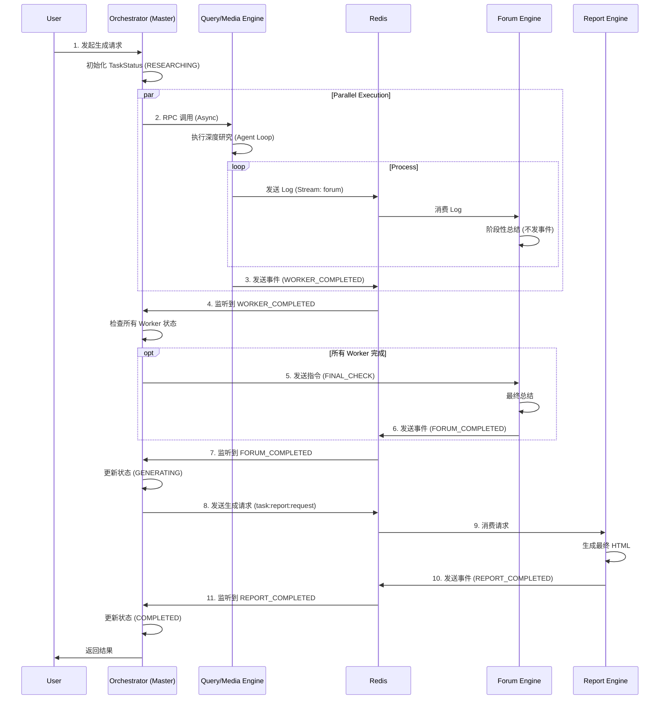

# Souyu 项目

Souyu 是一个基于现代 Java 技术栈构建的综合性分布式系统，专注于查询处理、媒体处理、报表生成和论坛交互等领域的 AI 驱动能力。
本项目是基于bettafish的分布式java重构，原项目链接为https://github.com/666ghj/BettaFish。
## 🛠 技术栈

- **编程语言**: Java 17
- **核心框架**: Spring Boot 3.3.0, Spring Cloud 2023.0.2
- **AI 集成**: Spring AI 1.0.0-M1 (OpenAI)
- **数据库与缓存**:
  - Redis (Spring Data Redis)
  - MongoDB (Spring Data MongoDB)
- **分布式协调**: Redisson (分布式锁)
- **构建工具**: Maven
- **消息队列**: Redis Stream, Redis Pub/Sub
- **RPC 框架**: Spring Cloud OpenFeign

## 📊 系统架构图
###任务执行时序流 (状态机驱动)

## 🏗 架构与模块

本项目采用多模块 Maven 结构，包含以下几个核心引擎：

### 1. 编排引擎 (`orchestrator`)
**核心控制中心**，负责整个任务的生命周期管理。
- **功能**:
  - **状态机管理**: 维护任务状态 (`TaskStatus`)，从 `RESEARCHING` -> `SUMMARIZING` -> `GENERATING` -> `COMPLETED`。
  - **事件驱动**: 监听 Redis Stream (`task:events:stream`)，响应 Worker 和 Forum 的完成事件。
  - **任务分发**: 通过 OpenFeign 向下游 Worker 发送指令，通过 Redis Stream 向 Report Engine 发送生成请求。
  - **超时兜底**: `TaskTimeoutMonitor` 定时扫描卡死任务，执行重试或降级策略。
- **技术**: Spring Boot, Redis Stream, Redisson, OpenFeign, Scheduled Task。

### 2. 查询引擎 (`query-engine`)
负责处理搜索和查询任务，集成了 Tavily 搜索 API。
- **角色**: Worker
- **核心组件**: `QueryAgent` (继承自 `AbstractAgent`)
- **功能**:
  - **多模式搜索**: 支持基础新闻搜索、深度搜索、最近24小时/一周新闻搜索、按日期范围搜索。
  - **智能配置**: 动态调整搜索参数（超时、最大结果数等）。
  - **结果标准化**: 将 Tavily 的搜索结果转换为统一格式供下游使用。
- **技术**: Spring AI, Tavily API, Redisson。

### 3. 媒体引擎 (`media-engine`)
负责媒体内容的管理和处理，集成了 Bocha 搜索 API。
- **角色**: Worker
- **核心组件**: `BochaAgent` (继承自 `AbstractAgent`)
- **功能**:
  - **综合搜索**: 支持全网综合搜索和纯网页搜索。
  - **结构化数据**: 支持搜索结构化数据。
  - **Prompt 定制**: 针对 Bocha 引擎定制了报告结构、初次搜索、反思总结等阶段的 Prompt。
- **技术**: Spring AI, Bocha API, Redis。

### 4. 报表引擎 (`report-engine`)
负责生成和管理各类报表。
- **角色**: Worker (纯计算节点)
- **核心组件**: `ReportAgent`, `ReportRequestConsumer`
- **工作流程**:
  1. **异步消费**: 监听 `task:report:request` Stream，接收生成请求。
  2. **模板选择**: 动态选择或加载 Markdown 模板，利用 `TemplateParser` 切分章节。
  3. **全局规划**: 确定文章标题、目录结构、设计风格和篇幅预算。
  4. **分章生成**: 逐章生成内容，注入全局上下文，内置重试机制。
  5. **完成通知**: 生成完成后，发送 `REPORT_COMPLETED` 事件到 `task:events:stream`。
- **技术**: Spring Cloud OpenFeign, Spring AI, Jackson, 模板引擎, Redis Stream。

### 5. 论坛引擎 (`forum-engine`)
管理社区和论坛功能。
- **角色**: Logger & Host
- **核心组件**: `consumer`
- **功能**:
  - **日志聚合**: 监听 `forum` Stream，将各引擎的研究成果 (`OneLog`) 聚合到 MongoDB 的 `forum_logs` 集合中。
  - **智能总结**: 通过 Lua 脚本 (`log_summary.lua`) 实现计数器，当日志达到一定数量时，自动触发 AI 生成阶段性总结 (`HOST` 角色)，并存入 MongoDB。
  - **最终检查**: 响应 Orchestrator 的 `FINAL_CHECK` 指令，完成最终总结并发送完成事件。
- **技术**: MongoDB, Redis Stream, Redisson, Lua。

### 6. 公共模块 (`common`)
- **`AbstractAgent`**: 定义了 Agent 的通用行为（搜索、反思、事件发送、**任务取消响应**）。
- **`TaskStatusManager`**: 封装了基于 MongoDB 和 Redisson 的状态机逻辑。
- **`TaskControlManager`**: 基于 Redis Pub/Sub 实现任务取消指令的广播与接收。
- **`messageProducer`**: 统一的消息发送组件。

## 🚀 核心实现思路

### 1. AI 深度集成 (Agent 模式)
系统采用 Agent 模式设计，但根据业务场景分为两种不同的实现范式：

#### A. 研究型 Agent (`QueryAgent`, `BochaAgent`)
继承自 `AbstractAgent`，专注于**深度信息挖掘与自我反思**。
- **报告结构生成**: 利用 LLM 生成研究大纲。
- **段落并行处理**:
  - **首次搜索**: 获取基础信息。
  - **反思循环 (Reflection Loop)**: 
    - **自我反思**: AI 分析当前信息是否充足。
    - **补充搜索**: 执行针对性搜索（如按日期）。
    - **增量总结**: 结合新旧信息更新摘要。
    - **协同共享**: 通过 Redis Stream 分享研究成果。
- **最终报告**: 汇总所有段落生成简报。

#### B. 编排型 Agent (`ReportAgent`)
**不继承** `AbstractAgent`，而是作为一个**基于模板驱动的流水线编排器**，专注于将零散信息组装成结构严谨的长文档。
- **模板驱动**: 动态选择或加载 Markdown 模板，利用 `TemplateParser` 切分章节。
- **全局规划**: 
  - **布局设计**: 确定文章标题、目录结构、设计风格。
  - **篇幅预算**: 智能分配每个章节的字数预算。
- **分章生成**: 逐章生成内容，注入全局上下文，内置重试机制。
- **流式反馈**: 支持细粒度的流式事件 (`stage`, `progress`, `chapter_chunk`)。

### 2. 状态机驱动架构 (State-Driven Architecture)
系统不再依赖脆弱的计数器，而是通过 **Orchestrator** 维护一个中心化的状态机 (`TaskStatus`)。
- **状态流转**:
  1.  **RESEARCHING**: Orchestrator 启动 Query/Media Engine 并行工作。
  2.  **SUMMARIZING**: 所有 Worker 完成后，Orchestrator 指令 Forum Engine 进行最终总结。
  3.  **GENERATING**: Forum 完成后，Orchestrator 发送消息触发 Report Engine 生成最终报告。
  4.  **COMPLETED**: 报告生成完毕，流程结束。

### 3. 事件驱动通信
- **Worker -> Master**: Worker 完成任务后，不直接调用 Master，而是发送 `WORKER_COMPLETED` 事件到 Redis Stream。
- **Forum -> Master**: Forum 完成最终总结后，发送 `FORUM_COMPLETED` 事件。
- **Master -> Forum**: Master 通过发送 `FINAL_CHECK` 指令（复用 Stream 或 RPC）触发 Forum 的收尾工作。
- **Master -> Report**: Master 通过发送消息到 `task:report:request` Stream 触发报告生成（解决 Feign 超时问题）。
- **Report -> Master**: Report Engine 完成后，发送 `REPORT_COMPLETED` 事件。

### 4. 鲁棒性设计 (Robustness)

#### A. 超时兜底 (Timeout Recovery)
Orchestrator 的 `TaskTimeoutMonitor` 组件通过 `@Scheduled` 定时任务（每分钟）扫描 MongoDB 中长时间未更新的任务，并根据当前状态执行恢复策略：

- **RESEARCHING 阶段超时**:
  - **检测**: 任务状态为 `RESEARCHING` 且 `updatedAt` 超过 10 分钟。
  - **策略**: 检查 `workerStatus`，识别未完成的 Worker（如 `QueryEngine`）。
  - **操作**: 重新调用 RPC 接口触发该 Worker。
  - **失败处理**: 若重试次数超过 3 次，或检测到任意 Worker 状态为 `FAILED`，则标记整个任务为 `FAILED` 并触发快速失败。

- **SUMMARIZING 阶段超时**:
  - **检测**: 任务状态为 `SUMMARIZING` 且超时。
  - **策略**: Forum Engine 可能卡死或消息丢失。
  - **操作**: 重新发送 `FINAL_CHECK` 指令。
  - **降级处理**: 若重试超过 3 次，执行**服务降级**——跳过 Forum 总结，强制将状态流转至 `GENERATING`，确保用户能拿到基础报告。

- **GENERATING 阶段超时**:
  - **检测**: 任务状态为 `GENERATING` 且超时。
  - **策略**: Report Engine 生成耗时过长或崩溃。
  - **操作**: 重新发送 `task:report:request` 消息到 Redis Stream。

#### B. 快速失败与任务取消 (Fail Fast & Cancellation)
为了节省昂贵的 AI 算力和 Token 消耗，系统实现了分布式任务取消机制：

1.  **触发条件**: 
    - 当 `TaskTimeoutMonitor` 判定任务失败（如重试超限）。
    - 或当任意 Worker 报告明确的 `FAILED` 状态。
2.  **广播指令**: 
    - Orchestrator 通过 Redis Pub/Sub 频道 `task:control` 广播 `CANCEL:{taskId}` 指令。
3.  **Worker 响应**: 
    - 所有 Worker (`AbstractAgent`) 均订阅该频道。
    - Worker 在执行长耗时操作（如 `processParagraph`, `reflectionLoop`）的每个关键节点前，都会检查本地的 `cancelledTasks` 缓存。
    - 一旦发现当前任务被取消，立即抛出异常中断执行，停止后续的 LLM 调用和搜索请求。

### 5. 分布式一致性
- **MongoDB**: 作为“单一事实来源”存储任务状态 (`TaskStatus`) 和业务数据。
- **Redisson**: 使用分布式锁 (`lock:task:{id}`) 保护状态流转逻辑，防止并发事件导致的状态错乱。

