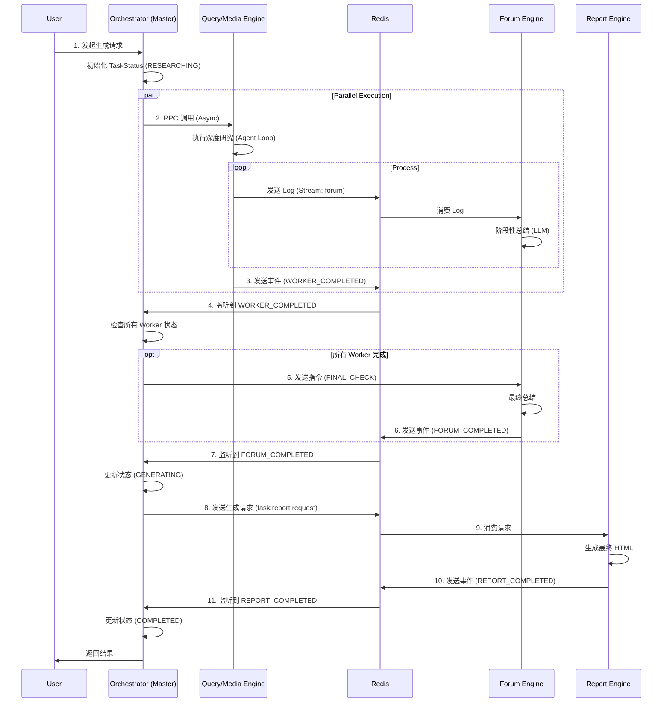
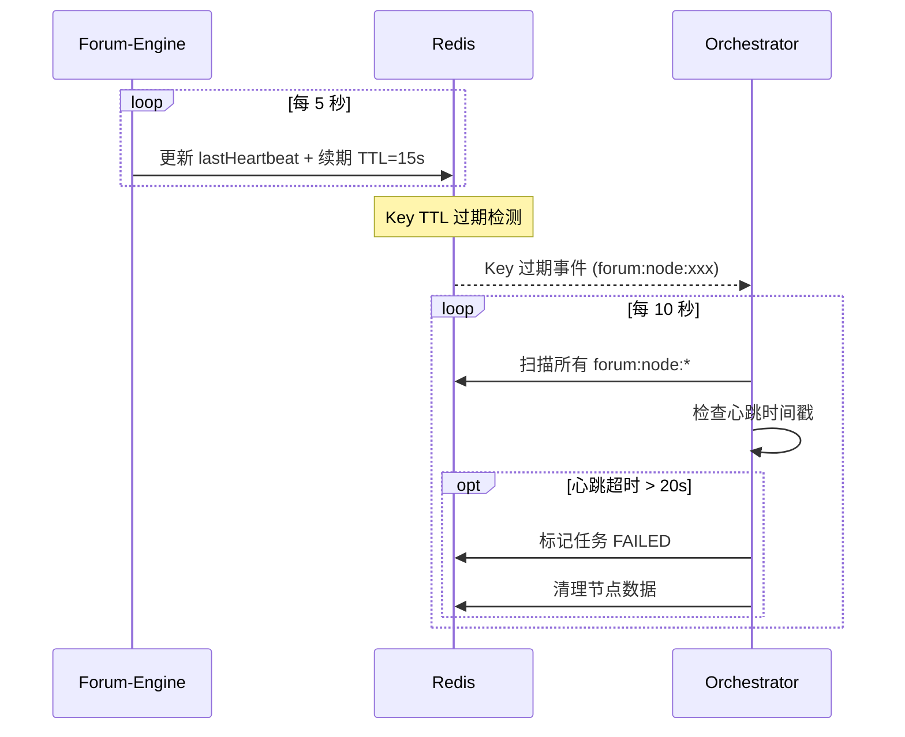

# Souyu

Souyu 是一个基于现代 Java 技术栈构建的综合性分布式系统，专注于查询处理、媒体处理、报表生成和论坛交互等领域的 AI 驱动能力。

本项目是基于 bettafish 的分布式 Java 重构，原项目链接为 https://github.com/666ghj/BettaFish。

---

## 🛠 技术栈

- **编程语言**: Java 17
- **核心框架**: Spring Boot 3.3.0, Spring Cloud 2023.0.2
- **AI 集成**: Spring AI 1.0.0-M1 (OpenAI)
- **数据库与缓存**:
  - Redis (Spring Data Redis)
  - MongoDB (Spring Data MongoDB)
- **分布式协调**: Redisson (分布式锁)
- **构建工具**: Maven
- **消息队列**: Redis Stream, Redis Pub/Sub
- **RPC 框架**: Spring Cloud OpenFeign

---

## 📊 系统架构图

### 任务执行时序流 (状态机驱动)



### Forum-Engine 心跳架构



---

## 🏗 架构与模块

本项目采用多模块 Maven 结构，包含以下几个核心引擎：

### 1. 编排引擎 (`orchestrator`)
**核心控制中心**，负责整个任务的生命周期管理。
- **功能**:
  - **状态机管理**: 维护任务状态 (`TaskStatus`)，从 `RESEARCHING` -> `SUMMARIZING` -> `GENERATING` -> `COMPLETED`。
  - **事件驱动**: 监听 Redis Stream (`task:events:stream`)，响应 Worker 和 Forum 的完成事件。
  - **任务分发**: 通过 OpenFeign 向下游 Worker 发送指令，通过 Redis Stream 向 Report Engine 发送生成请求。
  - **超时兜底**: `TaskTimeoutMonitor` 定时扫描卡死任务，执行重试或降级策略。
  - **健康检测**: `ForumHealthChecker` 定期扫描 Forum-Engine 节点，检测死亡节点并触发故障转移。
- **技术**: Spring Boot, Redis Stream, Redisson, OpenFeign, Scheduled Task。

### 2. 查询引擎 (`query-engine`)
负责处理搜索和查询任务，集成了 Tavily 搜索 API。
- **角色**: Worker
- **核心组件**: `QueryAgent` (继承自 `AbstractAgent`)
- **功能**:
  - **多模式搜索**: 支持基础新闻搜索、深度搜索、最近24小时/一周新闻搜索、按日期范围搜索。
  - **智能配置**: 动态调整搜索参数（超时、最大结果数等）。
  - **结果标准化**: 将 Tavily 的搜索结果转换为统一格式供下游使用。
- **技术**: Spring AI, Tavily API, Redisson。

### 3. 媒体引擎 (`media-engine`)
负责媒体内容的管理和处理，集成了 Bocha 搜索 API。
- **角色**: Worker
- **核心组件**: `BochaAgent` (继承自 `AbstractAgent`)
- **功能**:
  - **综合搜索**: 支持全网综合搜索和纯网页搜索。
  - **结构化数据**: 支持搜索结构化数据。
  - **Prompt 定制**: 针对 Bocha 引擎定制了报告结构、初次搜索、反思总结等阶段的 Prompt。
- **技术**: Spring AI, Bocha API, Redis。

### 4. 报表引擎 (`report-engine`)
负责生成和管理各类报表。
- **角色**: Worker (纯计算节点)
- **核心组件**: `ReportAgent`, `ReportRequestConsumer`
- **工作流程**:
  1. **异步消费**: 监听 `task:report:request` Stream，接收生成请求。
  2. **模板选择**: 动态选择或加载 Markdown 模板，利用 `TemplateParser` 切分章节。
  3. **全局规划**: 确定文章标题、目录结构、设计风格和篇幅预算。
  4. **分章生成**: 逐章生成内容，注入全局上下文，内置重试机制。
  5. **完成通知**: 生成完成后，发送 `REPORT_COMPLETED` 事件到 `task:events:stream`。
- **技术**: Spring Cloud OpenFeign, Spring AI, Jackson, 模板引擎, Redis Stream。

### 5. 论坛引擎 (`forum-engine`)
管理社区和论坛功能，负责日志聚合和智能总结。
- **角色**: Logger & Host
- **核心组件**: `ForumNodeLifecycle`, `ForumMessageHandler`, `ForumStreamConsumer`
- **架构特点**:
  - **只发送心跳**: Forum-Engine 只负责维护自己的心跳，不做任何检测操作。
  - **外部检测**: 死亡检测由 Orchestrator 负责，通过 Redis 过期事件 + 定期扫描双层保障。
  - **低 Redis 压力**: 每次心跳只操作自己的 Key，复杂度 O(1)。
- **功能**:
  - **日志聚合**: 消费 Redis Stream，将各引擎的研究成果聚合到 MongoDB。
  - **智能总结**: 每收到 5 条日志触发阶段性总结，调用 LLM 生成主持人发言。
  - **最终检查**: 响应 Orchestrator 的 `FINAL_CHECK` 指令，完成最终总结。
- **技术**: MongoDB, Redis Stream, Virtual Thread, Lua。

### 6. 反思引擎 (`reflection-engine`)
独立的反思评判服务，为 AbstractAgent 提供质量评估和搜索指导。
- **角色**: 质量评估服务
- **核心组件**: `ReflectionService`, `ReflectionController`
- **功能**:
  - **双视角验证**: 使用另一种搜索引擎独立搜索，对比 AbstractAgent 的结果。
  - **LLM 评判**: 评估当前摘要的质量，识别知识缺口。
  - **早停决策**: 质量达标时建议停止继续搜索，节省 Token。
- **技术**: Spring AI, Tavily/Bocha API, Java 21 Virtual Thread。

### 7. 公共模块 (`common`)
- **`AbstractAgent`**: 定义了 Agent 的通用行为（搜索、反思、事件发送、任务取消响应）。
- **`TaskStatusManager`**: 封装了基于 MongoDB 和 Redisson 的状态机逻辑。
- **`TaskControlManager`**: 基于 Redis Pub/Sub 实现任务取消指令的广播与接收。
- **`messageProducer`**: 统一的消息发送组件。
- **`ForumFailoverManager`**: 故障转移管理器，由 Orchestrator 调用执行节点故障转移。

---

## 🚀 核心实现思路

### 1. AI 深度集成 (Agent 模式)

#### A. 研究型 Agent (`QueryAgent`, `BochaAgent`)
继承自 `AbstractAgent`，专注于**深度信息挖掘与自我反思**。
- **报告结构生成**: 利用 LLM 生成研究大纲。
- **段落并行处理**: 使用 Java 21 Virtual Thread 并发处理各段落。
  - **首次搜索**: 获取基础信息。
  - **反思循环 (Reflection Loop)**:
    - **外部反思**: 调用 Reflection-Engine 进行质量评估。
    - **补充搜索**: 根据反思建议执行针对性搜索。
    - **增量总结**: 结合新旧信息更新摘要。
  - **早停机制**: 质量达标或达到最大反思轮次 (3次) 时停止。
- **最终报告**: 汇总所有段落生成简报。

#### B. 编排型 Agent (`ReportAgent`)
**不继承** `AbstractAgent`，而是作为**基于模板驱动的流水线编排器**。
- **模板驱动**: 动态选择或加载 Markdown 模板，切分章节。
- **全局规划**: 确定文章标题、目录结构、设计风格和篇幅预算。
- **分章生成**: 逐章生成内容，注入全局上下文。

### 2. 状态机驱动架构
通过 **Orchestrator** 维护中心化的状态机 (`TaskStatus`)。
- **状态流转**: `RESEARCHING` -> `SUMMARIZING` -> `GENERATING` -> `COMPLETED`

### 3. 事件驱动通信
- **Worker -> Master**: 通过 Redis Stream 发送完成事件。
- **Master -> Forum**: 发送 `FINAL_CHECK` 指令触发收尾。
- **Master -> Report**: 通过 Redis Stream 发送生成请求。

### 4. 心跳与故障检测

#### Forum-Engine 心跳机制
- **简化设计**: Forum-Engine 只发送心跳，不做检测。
- **检测外包**: 由 Orchestrator 负责检测死亡节点。
- **双层保障**:
  1. **Redis 过期事件** (可选): Key TTL 过期时自动触发。
  2. **Orchestrator 扫描**: 每 10 秒扫描一次所有节点。

#### 故障转移流程
```
1. Orchestrator 检测到节点死亡（Key 不存在或心跳超时）
2. 获取该节点的所有任务
3. 标记任务状态为 FAILED
4. 清理节点在 Redis 中的数据
5. 任务可被重新调度到其他健康节点
```

### 5. 鲁棒性设计

#### 超时兜底
- **RESEARCHING 超时**: 重试 Worker，3 次失败后标记 FAILED。
- **SUMMARIZING 超时**: 重试 Forum，3 次失败后降级跳过。
- **GENERATING 超时**: 重试 Report。

#### 快速失败与任务取消
- Orchestrator 通过 Redis Pub/Sub 广播取消指令。
- Worker 在每个关键节点检查取消状态，立即中断执行。

---

## 📈 项目统计

### 代码行数

| 模块 | Java 代码行数 | 占比 |
|------|--------------|------|
| **common** | 7,232 | 41.6% |
| **report-engine** | 6,758 | 38.9% |
| **forum-engine** | 1,323 | 7.6% |
| **orchestrator** | 881 | 5.1% |
| **reflection-engine** | 609 | 3.5% |
| **query-engine** | 322 | 1.8% |
| **media-engine** | 266 | 1.5% |
| **总计** | **17,391** | 100% |

- **配置文件** (yml/yaml): 395 行
- **Markdown 文档**: 3,039 行
- **项目总计**: ~20,825 行

---

## 📚 文档索引

- [架构对比分析](./docs/architecture-comparison.md) - Forum-Engine 新旧架构详细对比
- [心跳检测简化方案](./docs/heartbeat-architecture-simplified.md) - 简化的心跳检测设计
- [心跳改造执行计划](./docs/heartbeat-migration-plan.md) - 改造任务清单

---

## 🚧 开发计划

- [x] Forum-Engine 架构重构（只发送心跳）
- [x] 心跳检测迁移到 Orchestrator
- [ ] Redis 过期事件监听（可选增强）
- [ ] 监控指标接入（Prometheus + Grafana）
- [ ] 自动扩缩容支持

---

## 📄 License

本项目基于原项目 [BettaFish](https://github.com/666ghj/BettaFish) 进行分布式重构。
