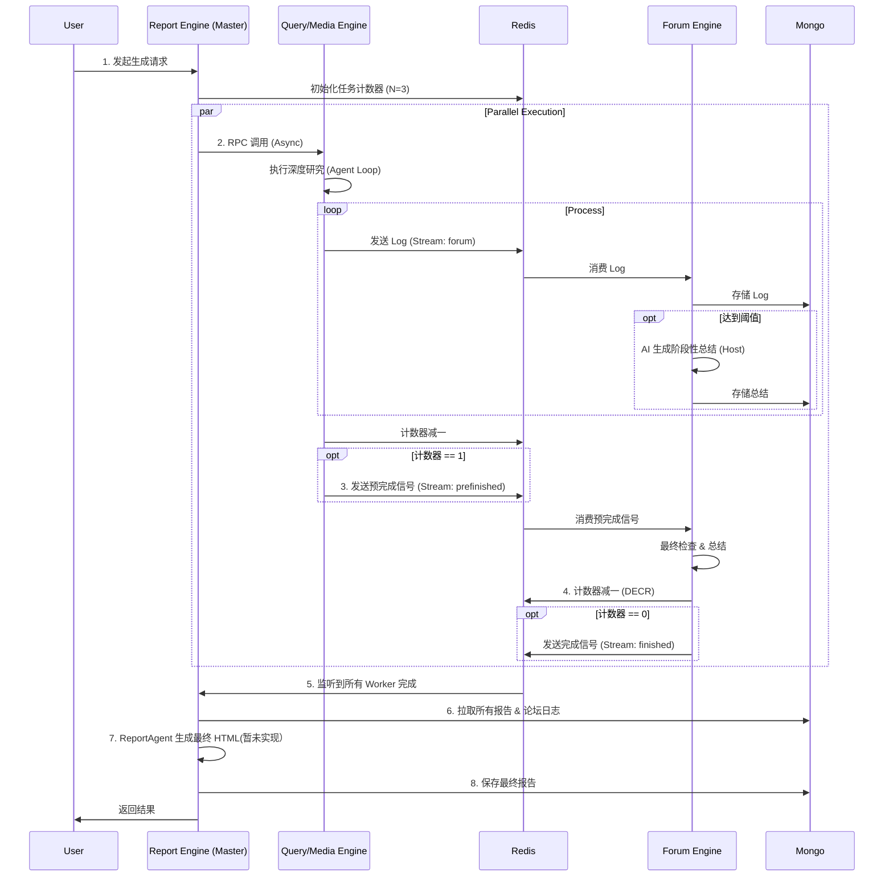

# Souyu 

Souyu 是一个基于现代 Java 技术栈构建的综合性分布式系统，专注于查询处理、媒体处理、报表生成和论坛交互等领域的 AI 驱动能力。
本项目是bettafish的java spring ai重写，原项目地址为https://github.com/666ghj/BettaFish。
## 🛠 技术栈

- **编程语言**: Java 17
- **核心框架**: Spring Boot 3.3.0, Spring Cloud 2023.0.2
- **AI 集成**: Spring AI 1.0.0-M1 (OpenAI)
- **数据库与缓存**:
  - Redis (Spring Data Redis)
  - MongoDB (Spring Data MongoDB)
- **分布式协调**: Redisson (分布式锁)
- **构建工具**: Maven
- **消息队列**: Redis Stream
- **RPC 框架**: Spring Cloud OpenFeign

## 📊 任务执行时序流 (Master-Worker 回调)


## 🏗 架构与模块

本项目采用多模块 Maven 结构，包含以下几个核心引擎：

### 1. 查询引擎 (`query-engine`)
负责处理搜索和查询任务，集成了 Tavily 搜索 API。
- **核心组件**: `QueryAgent`
- **功能**:
  - **多模式搜索**: 支持基础新闻搜索、深度搜索、最近24小时/一周新闻搜索、按日期范围搜索。
  - **智能配置**: 动态调整搜索参数（超时、最大结果数等）。
  - **结果标准化**: 将 Tavily 的搜索结果转换为统一格式供下游使用。
- **技术**: Spring AI, Tavily API, Redisson。

### 2. 媒体引擎 (`media-engine`)
负责媒体内容的管理和处理，集成了 Bocha 搜索 API。
- **核心组件**: `BochaAgent`
- **功能**:
  - **综合搜索**: 支持全网综合搜索和纯网页搜索。
  - **结构化数据**: 支持搜索结构化数据。
  - **Prompt 定制**: 针对 Bocha 引擎定制了报告结构、初次搜索、反思总结等阶段的 Prompt。
- **技术**: Spring AI, Bocha API, Redis。

### 3. 报表引擎 (`report-engine`)
负责生成和管理各类报表，是系统的核心输出模块。
- **核心组件**: `ReportAgent`
- **工作流程**:
  1. **模板选择 (`TemplateSelectionNode`)**: 根据用户 Query 和上下文自动选择合适的 Markdown 模板，或使用用户自定义模板。
  2. **模板切片 (`TemplateParser`)**: 解析 Markdown 模板，将其拆分为独立的章节 (`TemplateSection`)。
  3. **布局设计 (`DocumentLayoutNode`)**: 基于模板和搜索结果，规划文档的整体结构、标题、目录和主题风格。
  4. **篇幅规划 (`WordBudgetNode`)**: 智能分配各章节的字数预算和写作指导方针。
  5. **内容生成 (`ChapterGenerationNode`)**: 
     - 逐章并行或串行生成内容。
     - 支持流式输出 (`streamHandler`)，实时反馈生成进度。
     - 具备重试机制，确保内容生成的稳定性。
  6. **装订与渲染 (`DocumentComposer`)**: 将生成的各章节 JSON 数据组装成中间表示 (IR)，最终渲染为 HTML 报告。
- **技术**: Spring Cloud OpenFeign, Spring AI, Jackson, 模板引擎。

### 4. 论坛引擎 (`forum-engine`)
管理社区和论坛功能。
- **核心组件**: `consumer`
- **功能**:
  - **日志聚合**: 监听 `forum` Stream，将各引擎的研究成果 (`OneLog`) 聚合到 MongoDB 的 `forum_logs` 集合中。
  - **智能总结**: 通过 Lua 脚本 (`log_summary.lua`) 实现计数器，当日志达到一定数量时，自动触发 AI 生成阶段性总结 (`HOST` 角色)，并存入 MongoDB。
  - **任务协调**: 监听 `task:prefinished:stream`，在 Worker 完成前进行最终检查和总结，确保数据完整性。
- **技术**: MongoDB, Redis Stream, Redisson, Lua。

### 5. 公共模块
- **`common`**: 
  - **`AbstractAgent`**: 定义了 Agent 的通用行为（搜索工具执行、结果提取、Prompt 管理），`QueryAgent` 和 `BochaAgent` 均继承自此基类。
  - **工具客户端**: 封装了 TavilyClient, BochaClient 等外部 API 调用。
  - **消息队列**: 封装了基于 Redis Stream 的消息生产者 (`messageProducer`) 和消费者逻辑。
  - **状态管理**: `StateManager` 使用 Redis 和 MongoDB 混合存储任务状态和元数据。
- **`shared-dto`**: 定义模块间共享的数据传输对象 (DTO)，确保数据结构一致性。

## 🚀 核心实现思路

### 1. AI 深度集成 (Agent 模式)
系统采用 Agent 模式设计，但根据业务场景分为两种不同的实现范式：

#### A. 研究型 Agent (`QueryAgent`, `BochaAgent`)
继承自 `AbstractAgent`，专注于**深度信息挖掘与自我反思**。
- **报告结构生成**: 利用 LLM 生成研究大纲。
- **段落并行处理**:
  - **首次搜索**: 获取基础信息。
  - **反思循环 (Reflection Loop)**: 
    - **自我反思**: AI 分析当前信息是否充足。
    - **补充搜索**: 执行针对性搜索（如按日期）。
    - **增量总结**: 结合新旧信息更新摘要。
    - **协同共享**: 通过 Redis Stream 分享研究成果。
- **最终报告**: 汇总所有段落生成简报。

#### B. 编排型 Agent (`ReportAgent`)
**不继承** `AbstractAgent`，而是作为一个**基于模板驱动的流水线编排器**，专注于将零散信息组装成结构严谨的长文档。
- **模板驱动 (Template-Driven)**:
  - 动态选择或加载 Markdown 模板。
  - 利用 `TemplateParser` 将模板切分为独立的章节 (`TemplateSection`)，构建文档骨架。
- **全局规划 (Global Planning)**:
  - **布局设计 (`DocumentLayoutNode`)**: 确定文章标题、目录结构、设计风格（配色、字体）。
  - **篇幅预算 (`WordBudgetNode`)**: 根据总字数要求，智能分配每个章节的字数预算，确保详略得当。
- **分章生成 (Chapter Generation)**:
  - 通过 `ChapterGenerationNode` 逐章生成内容。
  - **上下文注入**: 每个章节生成时都能感知到全局上下文（Query, Reports, Forum Logs）和上一章的生成结果，保证逻辑连贯。
  - **鲁棒性设计**: 内置重试机制，防止生成内容过短或失败。
- **流式反馈与装订**:
  - 支持细粒度的流式事件 (`stage`, `progress`, `chapter_chunk`)，前端可实时展示生成进度。
  - 最后通过 `DocumentComposer` 将分散的章节组装成完整的 HTML 报告。

### 2. 分布式架构与通信
- **RPC 通信 (OpenFeign)**: 
  - `report-engine` 作为协调者，通过 Feign Client 同步调用 `query-engine` 和 `media-engine` 获取深度研究结果。
  - 这种同步调用确保了报表生成时数据的即时性和完整性。
- **异步消息 (Redis Stream)**: 
  - **多主题通信**:
    - `forum` Stream: 用于聚合各研究型 Agent 的日志。
    - `task:prefinished:stream`: 用于 Worker 完成前的预处理信号。
    - `task:finished:stream`: 用于通知 Master 所有 Worker 已完成。
  - **智能日志处理 (`forum-engine`)**:
    - `consumer` 组件监听 `forum` Stream，将日志存入 MongoDB。
    - 使用 Lua 脚本实现高效计数，当日志量达到阈值时，自动调用 AI 生成总结，扮演 "主持人" (HOST) 角色。
- **分布式回调机制 (Master-Worker 模式)**:
  - **任务分发**: 主任务启动后，`QueryAgent` 和 `BochaAgent` 作为 Worker 并行执行深度研究。
  - **状态同步**: 
    - 初始计数器设为 **3** (假设 workerCount=3，或者根据实际配置)。
    - Worker 完成任务后，发送 `prefinished` 信号。
    - `forum-engine` 进行最终检查和总结，然后通过 Redis 的 `AtomicLong` 计数器递减 (`DECR`)。
    - **关键逻辑**: 仅当计数器减至 **1** 时（代表所有 Worker 都已完成，只剩 Master 待触发），才发送 `finished` 信号。
  - **Master 监听 (`MasterStreamListener`)**: 
    - `report-engine` 监听 `task:finished:stream`。
    - 当收到完成信号时，触发最终报告生成流程。
    - **数据聚合**: 从 MongoDB 中拉取各 Worker 的研究报告 (`reports_query`, `reports_media`) 和论坛日志 (`forum_logs`)。
    - **最终生成**: 调用 `ReportAgent` 生成最终 HTML 报告并保存至 MongoDB (`reports_final`)。

### 3. 存储方案
- **MongoDB**: 
  - 作为核心持久化存储，用于保存论坛帖子、用户评论以及复杂的任务状态对象 (`State`)。
  - 利用其 Schema-less 特性灵活适应多变的 AI 生成内容结构。
- **Redis**: 
  - **高速缓存**: 缓存热点数据和临时任务状态。
  - **消息中间件**: 利用 Stream 数据结构实现轻量级消息队列。
  - **原子计数器**: 使用 `AtomicLong` 跟踪任务进度和并发数。

## 📝 快速开始

1. **环境准备**:
   - JDK 17+
   - Maven 3.8+
   - 运行中的 Redis, MongoDB 实例。
   - 配置 OpenAI, Tavily, Bocha 等 API Key。

2. **构建项目**:
   ```bash
   mvn clean install
   ```

3. **运行**:
   进入特定引擎目录（如 `query-engine`），运行 Spring Boot 应用程序。
